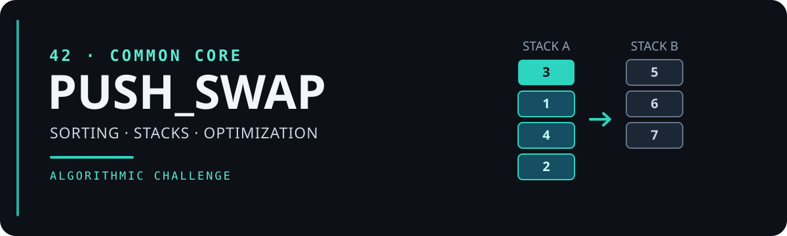

 

# `PUSH_SWAP`

### `42` · Common Core

**Sorting algorithms. Two stacks. Limited operations.**

A sorting challenge focused on algorithm design, optimization and problem solving in C.

 

)

 

  

    
  

 

[About](#about) · [Algorithm](#algorithm) · [Usage](#usage) · [Authors](#authors)

---

## About

**Push_swap** is a 42 Common Core project in which the goal is to sort a set of integers using two stacks and a limited set of operations.

The challenge is to produce a valid sequence of instructions while keeping the number of operations as low as possible.

---

## Algorithm

*Documentation in progress.*

---

## Usage

*Installation and usage instructions coming soon.*

---

## Authors

*Collaborators and project information coming soon.

# todo list:
  - [x] parse arguments
  - [x] operations
  - [x] errors
  - [x] validations
  - [x] make code tidier
  - [] insertion
  - [] radix
  - [] chunk
  - [] disorder metric
  - [] adaptive
  - [] debug & valgrind

resources:
  - C Programming: A Modern Approach
  15 Writing Large Programs
  15.1 Source Files
  15.2 Header Files
  15.3 Dividing a Program into Files
  15.4 Building a Multiple-File Program
  16 Structures, Unions, and Enumerations
  16.1 Structure Variables
  16.2 Structure Types
  17 Advanced Uses of Pointers
17.1 Dynamic Storage Allocation
 17.4 Deallocating Storage
  17.5 Linked Lists
   17.6 Pointers to Pointers
   9.6 Recursion
  - CS50x Week 3: Algorithms https://cs50.harvard.edu/x/weeks/3/
